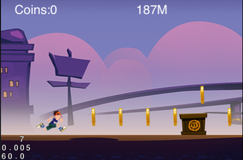
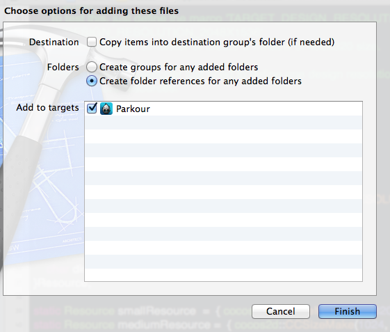
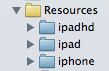
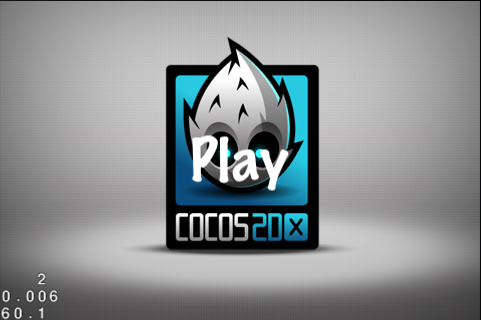
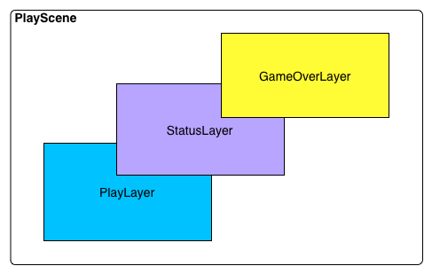
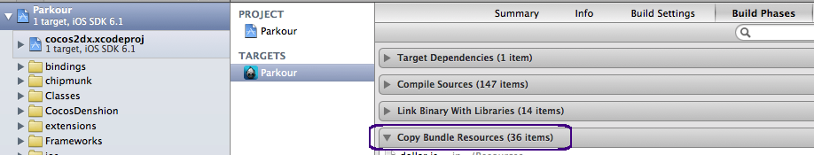
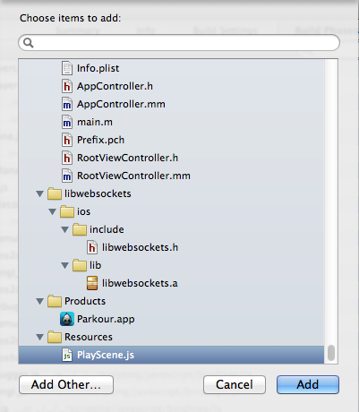
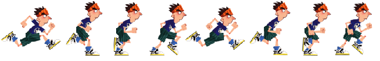
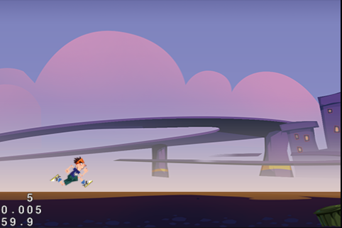

# Parkour Game Starter Kit
## Introduction
Parkour is a popular game genre. This starter kit equips you with the tools and skills you need to create a well polished and fun Parkour game for the iOS and Android using Cocos2D-x.

Picture speaks louder than words, so here’s a sneak peek of what you will be capable of doing by the end of this book:

In this starter kit, we use gesture to control the runner.
Swipe up to jump.
Swipe down to crouch.
Draw a circle to open the runner's incredible mode, which the runner move faster and can break rocks.

The starter kit use Cocos2d-x javascript binding to implement.

>The steps described in this article under Mac OS X, Xcode based development environment.

## About the authors

**KeNan Liu** is a developer and co-founder of  [ityran.com](http://www.ityran.com). He has 7 years experience in mobile software development at multi-platform. Such as Windows Mobile, Brew, iOS and Windows Phone 8.  He's current focus is on Cocos2d-x game development.
You can follow KeNan on [Weibo](http://weibo.com/lkncastle). 

**Iven Yang** is a developer currently focusing on Cocos2D-x development, and the co-founder of team Tyran.

## About the editor

**Yiming Guo** is a undergraduate who are interested in mobile networking, cloud computing and data mining.  Now is interning at Chengdu, focus on Cocos2d-x game development.

## About the artist

**Fan Wang** is a artist with 4 years of experience.

## Chapter 1: Getting Started
>Note: If you are already familiar with creating multi-platform project of Cocos2d-x, then you might want to skip ahead to the next section.

### Get Cocos2d-x
Open your web browser and navigate to the [Cocos2D-x download page](http://www.cocos2d-x.org/projects/cocos2d-x/wiki/Download).

There are several choices of which version of Cocos2D to download. For this Starter Kit, you will be using the latest stable version of Cocos2d-x.

At the time of writing this was cocos2d-x-2.1.5. Download it and extract it to a location of your choice.

### Creating a multi-platform project of Cocos2d-x
Open **Terminal** app. Use the **cd** command to switch to the directory where you extracted the Cocos2D-x archive, like this:

    cd ~/Documents/project/cocos2d-x-2.1.4/tools/project-creator

Creating project use create_project.py

    ./create_project.py -project Parkour -package org.cocos2d-x.Parkour -language javascript

If you see the following information, then the project successfully created.

    proj.ios		: Done!
    proj.android		: Done!
    proj.win32		: Done!
    New project has been created in this path: /Users/u0u0/Documents/project/cocos2d-x-2.1.4/projects/Parkour
    Have Fun!

As described above, create_project.py automatically creates iOS, Android and win32 project. In this document, we use iOS project as an example.

Switch to the project directory and open the project.

    cd ~/Documents/project/cocos2d-x-2.1.4/projects/Parkour/proj.ios
    open Parkour.xcodeproj

Now you are done with the project set-up, it’s time to code!

## Chapter 2: Setting up Multi-Resolution support
Cocos2d-x provides a set of api to make the game run on devices with different resolutions. The technical details of Multi-Resolution refer to this document.
#### FIXME: reference to Multi-Resolution document
This document just show how to use it.

Copy AppMacros.h from HelloCpp to Parkour project.

    cp ~/Documents/project/cocos2d-x-2.1.4/samples/Cpp/HelloCpp/Classes/AppMacros.h ~/Documents/project/cocos2d-x-2.1.4/projects/Parkour/Classes

Drag AppMacros.h onto the **Classes** folder in Xcode project. In the pop-up dialog, make sure that **Add to targets** is checked, then click Finish.

Open AppDelegate.cpp, include AppMacros.h at the top of the file.

    #include "AppMacros.h"

Replace applicationDidFinishLaunching with the following:

    // initialize director
    CCDirector *pDirector = CCDirector::sharedDirector();
    CCEGLView* pEGLView = CCEGLView::sharedOpenGLView();
    pDirector->setOpenGLView(pEGLView);
    
    // Set the design resolution
    pEGLView->setDesignResolutionSize(designResolutionSize.width, designResolutionSize.height, kResolutionFixedHeight);
    
    CCSize frameSize = pEGLView->getFrameSize();
    
    vector<string> searchPath;
    
    float mediumGap = (mediumResource.size.height - smallResource.size.height) / 2;
    
    if (frameSize.height > (smallResource.size.height + mediumGap)) {
        searchPath.push_back(mediumResource.directory);
        pDirector->setContentScaleFactor(mediumResource.size.height/designResolutionSize.height);
    } else {
        searchPath.push_back(smallResource.directory);
        pDirector->setContentScaleFactor(smallResource.size.height/designResolutionSize.height);
    }
    
    // set searching path
    CCFileUtils::sharedFileUtils()->setSearchPaths(searchPath);
    
    // turn on display FPS
    pDirector->setDisplayStats(true);
    
    // set FPS. the default value is 1.0/60 if you don't call this
    pDirector->setAnimationInterval(1.0 / 60);
    
    ScriptingCore* sc = ScriptingCore::getInstance();
    sc->addRegisterCallback(register_all_cocos2dx);
    sc->addRegisterCallback(register_all_cocos2dx_extension);
    sc->addRegisterCallback(register_cocos2dx_js_extensions);
    sc->addRegisterCallback(register_all_cocos2dx_extension_manual);
    sc->addRegisterCallback(register_CCBuilderReader);
    sc->addRegisterCallback(jsb_register_chipmunk);
    sc->addRegisterCallback(jsb_register_system);
    sc->addRegisterCallback(JSB_register_opengl);
    sc->addRegisterCallback(MinXmlHttpRequest::_js_register);

    sc->start();
    
    CCScriptEngineProtocol *pEngine = ScriptingCore::getInstance();
    CCScriptEngineManager::sharedManager()->setScriptEngine(pEngine);
    ScriptingCore::getInstance()->runScript("MainScene.js");

Here we use three different resources to adapt different resolutions.
Small resources in "iphone" directory, medium resources in "ipad" directory.

>Note: we changed the javascript entrance to file MainScene.js, rename main.js to MainScene.js. Directory "res" and "src" under Resources group will not use in Parkour, delete it from Xcode and click "Move to Trash".

Create these three directories, and drag them onto the Resources folder in your Xcode project. In the pop-up dialog, make sure that **Create folder references for any added folders** is selected, and **Add to targets** is checked, then click Finish.

Your Parkour Resource group should now look like this:

Parkour design resolution is 480X320, all images reference in this document will place in folder "iphone", and testing in **iPhone simulator**. After finish all game logic, we add the other resource and test it in different resolutions.

## Chapter 3: Adding a Main Menu to Main Scene
Now we got a clean Cocos2d-x JSB project, entrance with "MainScene.js". But need add something in MainScene.js to make it run.

Open "MainScene.js" and replace its contents with the following:

    // 1.
    require("jsb.js");

    // 2.
    var MainLayer = cc.Layer.extend({
        // 3.
        ctor:function () {
            this._super();
            this.init();
        },

        // 4.
        init:function () {
            this._super();
            var centerPos = cc.p(winSize.width / 2, winSize.height / 2);

            var spriteBG = cc.Sprite.create("MainBG.png");
            spriteBG.setPosition(centerPos);
            this.addChild(spriteBG);

            cc.MenuItemFont.setFontSize(60);
            var menuItemPlay = cc.MenuItemFont.create("Play", this.onPlay, this);
            var menu = cc.Menu.create(menuItemPlay);
            menu.setPosition(centerPos);
            this.addChild(menu);
        },

        // on play button clicked
        onPlay:function (sender) {
            // 5.
            log("==onPlay clicked");
        }
    });

    // 6.
    MainLayer.scene = function () {
        var scene = cc.Scene.create();
        var layer = new MainLayer();
        scene.addChild(layer);
        return scene;
    };

    // main entry
    try {
        // 7.
        director = cc.Director.getInstance();
        winSize = director.getWinSize();
        // run first scene
        director.runWithScene(MainLayer.scene());
    } catch(e) {log(e);}

Some important points to note:

1. **require()** will load a js module, use file name as parameter. "jsb.js" is the necessary module to be load if you want to use Cocos2d-x jsb to develop game. And a module only need to be loaded once in the runtime, then can use it anywhere.
2. **MainLayer = cc.Layer.extend();** It's the Cocos2d-x jsb way of object inheritance, it comes from [John Resig's javascript Inheritance](http://ejohn.org/blog/simple-javascript-inheritance/). In this case, we are defining a new class inheritance from CCLayer with name MainLayer.
3. **ctor()** will be called if new a MainLayer. It's the jsb way of constructor. Remember to call **this._super()** if you override this function. 
4. Override **init()** also need call **this._super()**. We creates a sprite using the background image you added previously, positions it at the center of the screen and adds it as a child of the MainLayer. Create a menu with a item named "Play", set item callback to function **onPlay()**.
5. Just log a message in function onPlay(), it's ok for now.
6. **MainLayer.scene = function (){};** define a static function for MainLayer.
7. Time to load main scene. Use **cc.Director.getInstance()** get the director, tell director run the first scene.

>Note:Here **director** and **winSize** are declare as global variables. Both are frequently used.

Build and run the project, and you should see the following displayed on screen:

## Chapter 4: PlayScene Overview
The main scene consists of three layers. 

### PlayLayer

The PlayLayer contains the runner, maps, coins and rocks.

The runner moves forward, the camera of the layer moves forward. In this way to keep the runner in the visible range. 

The background is composition of two horizontal maps. When then runner move from the first map to the second map, the first map will be reload and place to right of the second map. Map loop repeating in this way.

### StatusLayer

StatusLayer is on top of the PlayLayer. Coins count and distance statistics will display in this layer.

Why these two separate out on a new layer?

If coins count and distance statistics add to PlayLayer, they will disappear when the camera moving with the runner. Separate them from PlayLayer will keep things simple.

### GameOverLayer
GameOverLayer is a color layer. 

GameOverLayer will be displayed when the runner hits the rock, and gives a choice to restart game.

## Chapter 5: Setting Up PlayLayer with Physics World
PlayLayer is the most important layer of PlayScene. This layer handling player input, calculating collisions, objects movement and so on.

### Create a js file and add to Xcode project
First, create a file  with name "PalyScene.js" in **Resource** directory and drag onto the **Resource** folder in Xcode project. In the pop-up dialog, make sure that **Add to targets** is checked, then click Finish.

Second, select targets in Xcode project, switch to label "Build Phases", unfold the item "Copy bundle Resources".

Scroll to the bottom and click "+". In the pop-up dialog, select "PlayScene.js" and then click Add.

>Note: Add js file to "Copy bundle Resources" is a necessary step for iOS project. If not, you will see following error message when require the js.

    Cocos2d: Get data from file(PlayScene.jsc) failed!
    Cocos2d: JS: /Users/u0u0/Library/Application Support/iPhone Simulator/6.1/Applications/3F9658F6-12CB-422A-89E9-6719D04B4D4B/Parkour.app/MainScene.js:3:Error: can't open PlayScene.js: No such file or directory

### PlayLayer with Physics World

Open "PlayScene.js" and replace it's contents with the following:

    var PlayLayer = cc.Layer.extend({
        // 1.
        space:null,// chipmunk space

        // constructor
        ctor:function () {
            this._super();
            this.init();
        },

        init:function () {
            this._super();
            this.initPhysics();
            // 2.
            this.scheduleUpdate();
        },

        // 3.
        initPhysics:function() {
            // 4.
            this.space = new cp.Space();
            // 5.
            this.space.gravity = cp.v(0, -350);
            // 6. set up Walls
            var wallBottom = new cp.SegmentShape(this.space.staticBody,
                            cp.v(0, g_groundHight),// start point
                            cp.v(4294967295, g_groundHight),// MAX INT:4294967295
                            0);// thickness of wall
            this.space.addStaticShape(wallBottom);
        },

        update:function (dt) {
            // 7.
            this.space.step(dt);
        }
    });

    PlayLayer.scene = function () {
        var scene = cc.Scene.create();
        var layer = new PlayLayer();
        scene.addChild(layer);
        return scene;
    };

Some important points to note:

1. Define class member variable here. The left side of the semicolon is variable's name, and the right side is its initial value.
2. Schedules the "update" method
3. In this game, we use Chipmunk2D physics engine. Here are two sets of JSB APIs of Chipmunk. One is object-oriented, another is process-oriented. We just use the **object-oriented** one, which is more friendly. 
4. **new cp.Space()** is the object-oriented API to create a Chipmunk physics world. Corresponding process-oriented API is cp.spaceNew().
5. Set the gravity of physics world. cp.v() is equal to cc.p().
6. In parkour game the runner will run on the ground. The chipmunk way to make a ground is using static shape. New a SegmentShape from the static body of the space, and then add it to the space.
7. update() will be called on every frame. We need to call chipmunk step here to make physics world work.

The global variable g_groundHight is defined in file "Utils.js".

    var g_groundHight = 50;

To load the PlayScene, we need to go back to "MainScene.js", add the following in the top of the file.

    require("Utils.js");
    require("PlayScene.js");

And replace onPlay with the following:

    onPlay:function (sender) {
        cc.Director.getInstance().replaceScene(PlayLayer.scene());
    }

Build and run, click the "Play" button, you will see a black world on the screen. We will add something in following chapter. 

## Chapter 6: Running This Way
In this chapter we will add a sprite to the PlayLayer and make it running. We call this sprite  the runner.

To make it running, we need an animated sprite. The animation is all thanks to the sprite sheet that was part of the Resource folder. 

The sprite sheet consists of parkour.plist and parkour.png.
These files were generated by using **TexturePacker**, a sprite sheet creation tool.

>Note: Sprite sheet helps reduce memory consumption, speed up the drawing process and keep the frame rate high.

The animation composed of a series of images. 

As following picture:

Drag all the images to TexturePacker, then click Publish to output the sprite sheet. The usage of TexturePacker can find from its [official site](http://www.codeandweb.com/texturepacker/documentation).

Now we got two files "parkour.plist" and "parkour.png", move them to directory **Resource/iphone**.

Create a js file named "Runner.js" and add it to Xcode project as we done before.
Replace it's contents with following:

    // 1.
    if(typeof RunnerStat == "undefined") {
        var RunnerStat = {};
        RunnerStat.running = 0;
    };

    // 2.
    var Runner = cc.Node.extend({
        sprite:null,
        runningSize:null,
        space:null,
        body:null,// current chipmunk body
        shape:null,// current chipmunk shape
        stat:RunnerStat.running,// init with running status
        runningAction:null,
        spriteSheet:null,
        get offsetPx() {return 100;},

        // 3.
        ctor:function (spriteSheet, space) {
            this._super();

            this.spriteSheet = spriteSheet;
            this.space = space;
            this.init();
        },

        init:function () {
            this._super();

            // 4.
            this.sprite = cc.PhysicsSprite.createWithSpriteFrameName("runner0.png");
            this.runningSize = this.sprite.getContentSize();

            // 5.
            this.initAction();
            // 6.
            this.initBody();
            // 7.
            this.initShape();
            // 8.
            this.sprite.setBody(this.body);
            // 9.
            this.sprite.runAction(this.runningAction);
            // 10.
            this.spriteSheet.addChild(this.sprite, 1);
            // 11.
            this.stat = RunnerStat.running;
        },

        // 12.
        onExit:function() {
            this.runningAction.release();
        
            this._super();
        },

        // 13.
        getPositionX:function () {
            return this.sprite.getPositionX();
        },

        initAction:function () {
            // init runningAction
            var animFrames = [];
            // num equal to spriteSheet
            for (var i = 0; i < 8; i++) {
                var str = "runner" + i + ".png";
                var frame = cc.SpriteFrameCache.getInstance().getSpriteFrame(str);
                animFrames.push(frame);
            }

            var animation = cc.Animation.create(animFrames, 0.1);
            this.runningAction = cc.RepeatForever.create(cc.Animate.create(animation));
            this.runningAction.retain();
        },

        initBody:function () {
            // create chipmunk body
            this.body = new cp.Body(1, cp.momentForBox(1,
                            this.runningSize.width, this.runningSize.height));
            this.body.p = cc.p(this.offsetPx, g_groundHight + this.runningSize.height / 2);
            this.body.v = cp.v(150, 0);//run speed
            this.space.addBody(this.body);
        },

        initShape:function (type) {
            this.shape = new cp.BoxShape(this.body,
                            this.runningSize.width, this.runningSize.height);
            this.space.addShape(this.shape);
        },
    });

Some important points to note:

1. JS way to define a enum for runner state. The runner has many state, but for this chapter we just care the running state.
2. cc.PhysicsSprite have no extend method, so the Runner class is extended from cc.Node. 
3. The Runner will be created and placed in physics world of PlayLayer. So reference space in constructor. Reference the sprite sheet pass from PlayLayer too.
4. Before you call **cc.PhysicsSprite.createWithSpriteFrameName** to create physics sprite, you need to initialize the sprite frame cache from sprite sheet, which created by TexturePacker. This part of work will done in PlayLayer. "runner0.png" is the file name of first frame of animation.
5. In **initAction**, you create a animation from sprite frame cache, and make this animation repeats forever. Note this line of code **this.runningAction.retain();** --- retain() will avoid the CCObject be GC.
6. In **initBody**, create a chipmunk body for the runner. And set it initial velocity.
7. In **initShape**, create a chipmunk shape which size equal to sprite size.
8. Associate physics body with the sprite.
9. Tell the sprite run the runningAction.
10. Add the sprite to spriteSheet.
11. Record the state, we will use it in future chapter.
12. Override onExit to release runningAction, remember to call **this._super()** if you override this function. 
13. This helper function will be use to calculate camera moving in PlayLayer.

Switch to **PlayScene.js** and add the following in the top of the file:

    require("Runner.js");

Define new class member variable.

    spriteSheet:null,
    runner:null,
    lastEyeX:0,

Go to init() and make the following changes:

    // create sprite sheet of PlayLayer
    cc.SpriteFrameCache.getInstance().addSpriteFrames("parkour.plist");
    this.spriteSheet = cc.SpriteBatchNode.create("parkour.png");
    this.addChild(this.spriteSheet);

    this.runner = new Runner(this.spriteSheet, this.space);
    // runner is base on Node, addChild to make scheduleOnce and onExit call.
    this.addChild(this.runner);

Then go to update() and make the following changes:

    // move Camera
    this.lastEyeX = this.runner.getPositionX() - this.runner.offsetPx;
    var camera = this.getCamera();
    var eyeZ = cc.Camera.getZEye();
    camera.setEye(this.lastEyeX, 0, eyeZ);
    camera.setCenter(this.lastEyeX, 0, 0);

* The new position of the runner will be calculated in physics world within every frame. The camera need to follow the runner to keep the runner inside.

Build and run, and then you can see a boy running in the screen.

## Chapter 7: Gesture Recognizer
So far the runner can move himself forward. Before add user controls to the runner, you need to handle player's input.

In the game we use gesture control, include swipe up, swipe down and draw circle.

There is an open source project **$1 Unistroke Recognizer**, which can recognize 16 gesture types include circle. And the **$1 Unistroke Recognizer** just have a JavaScript version, which can be easily import into Cocos2d-x JSB project.

But **$1 Unistroke Recognizer** has a drawback: difficult to distinguish swipe up and swipe down. You have to recognize these two gestures by yourself.

### Simple Recognizer
Simple Recognizer can recognize simple gesture include swipe up, swipe down, swipe left and swipe right.

Create a js file named "SimpleRecognizer.js".
Replace it's contents with following:

    // 1.
    function Point(x, y)
    {
        this.X = x;
        this.Y = y;
    }

    // class define
    function SimpleRecognizer()
    {
        this.points = [];
        this.result = "";
    }

    SimpleRecognizer.prototype.beginPoint = function(x, y) {
        this.points = [];
        this.result = "";
        this.points.push(new Point(x, y));
    }

    SimpleRecognizer.prototype.movePoint = function(x, y) {
        this.points.push(new Point(x, y));
    
        if (this.result == "not support") {
            return;
        }

        var newRtn = "";
        var len = this.points.length;
        // 2.
        var dx = this.points[len - 1].X - this.points[len - 2].X;
        var dy = this.points[len - 1].Y - this.points[len - 2].Y;

        if (Math.abs(dx) > Math.abs(dy)) {
            // 3.
            if (dx > 0) {
                newRtn = "right";
            } else {
                newRtn = "left";
            }
        } else {
            // 4.
            if (dy > 0) {
                newRtn = "up";
            } else {
                newRtn = "down";
            }
        }

        // first set result
        if (this.result == "") {
            this.result = newRtn;
            return;
        }

        // if diretcory change, not support Recognizer
        if (this.result != newRtn) {
            this.result = "not support";
        }
    }

    SimpleRecognizer.prototype.endPoint = function(x, y) {
        if (this.points.length < 3) {
            return "error";
        }
        return this.result;
    }

    SimpleRecognizer.prototype.getPoints = function() {
        return this.points;
    }

Some important points to note:

1. Define the Point as same as dollar library. This allows the project to use both libraries become simple.
2. Each time when touch point moving, calculate difference of the x-axis and y-axis  between current touch point and previous touch point. 
3. In this case, movement tendency of touch point on the x-axis direction.
4. In this case, movement tendency of touch point on the y-axis direction.

### $1 Unistroke Recognizer
Open your web browser and navigate to <http://depts.washington.edu/aimgroup/proj/dollar/dollar.js>. Save this file to disk and move it to **Resource** directory. Add dollar.js to Xcode project as chapter 5 does.

Before using this library you need to do some optimization. 

These are 16 gesture types in this library.
To find the most suitable one,  it must traverse all of these types.
Comment out useless types can save cpu time. But you can **NOT** comment out all useless types, otherwise each recognition result will be "circle". You need to keep some distractors.

Let's optimize it.

Open dollar.js and modify the value of **NumUnistrokes**.

    var NumUnistrokes = 4;//16;

Comment out useless types but retain "triangle", "circle", "left square bracket" and "right square bracket". And fix array subscript of these four Unistrokes.

### Integrated into the PlayLayer
Switch to PlayScene.js, add following in the top of the file:

    require("SimpleRecognizer.js");
    require("dollar.js");

Define new class member variable.

    recognizer:null,
    dollar:null,

Go to init() and add following codes right after this.initPhysics().

    // enable touch
    this.setTouchEnabled(true);
    // set touch mode to kCCTouchesOneByOne
    this.setTouchMode(1);

    this.dollar = new DollarRecognizer();
    this.recognizer = new SimpleRecognizer();

You enable the touch of the layer, and set touch mode to kCCTouchesOneByOne, which receive touch point one at a time in event callbacks.

Add following codes to PlayLayer:

    onTouchBegan:function(touch, event) {
        var pos = touch.getLocation();
        this.recognizer.beginPoint(pos.x, pos.y);
        return true;
    },

    onTouchMoved:function(touch, event) {
        var pos = touch.getLocation();
        this.recognizer.movePoint(pos.x, pos.y);
    },

    onTouchEnded:function(touch, event) {
        var rtn = this.recognizer.endPoint();

        switch (rtn) {
            case "up":
                log("==jumping");
                break;
            case "down":
                log("==crouching");
                break;
            case "not support":
            case "error":
                // try dollar Recognizer
                // 0:Use Golden Section Search (original) 
                // 1:Use Protractor (faster)
                var result = this.dollar.Recognize(this.recognizer.getPoints(), 1);
                log(result.Name);
                if (result.Name == "circle") {
                    log("==incredible");
                }
                break;
        }
    },

    onTouchCancelled:function(touch, event) {
        log("==onTouchCancelled");
    },

Simple Recognizer is faster than $1 Unistroke Recognizer. Use it recognize  swipe up and swipe down first, if its fail then use $1 Unistroke Recognizer.

Build and run, try swipe up, swipe down and draw a circle. You will see following log.

    Cocos2d: JS: ==jumping
    Cocos2d: JS: ==crouching
    Cocos2d: JS: circle
    Cocos2d: JS: ==incredible

## Chapter 8: Jumping and Crouching
In this chapter you’ll add the typical controls for Parkour Game.

Before modifying the runner class, switch to **Utils.js** and add following  code.

    if(typeof SpriteTag == "undefined") {
        var SpriteTag = {};
        SpriteTag.runner = 0;
        SpriteTag.coin = 1;
        SpriteTag.rock = 2;
    };

Here you define a enum which will use in chipmunk for collision detection.

Go back to **Runner.js**, finishing the define of RunnerStat by adding following codes:

    RunnerStat.jumpUp = 1;
    RunnerStat.jumpDown = 2;
    RunnerStat.crouch = 3;
    RunnerStat.incredible = 4;

Define new class member variables for the runner.

    crouchSize:null,
    jumpUpAction:null,
    jumpDownAction:null,
    crouchAction:null,

The shape of the runner will change when crouch down. 
Record the crouch size which will be used in following code.
Go to **init()** and add following code:

    var tmpSprite = cc.PhysicsSprite.createWithSpriteFrameName("runnerCrouch0.png");
    this.crouchSize = tmpSprite.getContentSize();

And change

    this.initShape();

to

    this.initShape("running");

Of course, we also need to modify the implement of initShape(). Replace it's content with following:

    initShape:function (type) {
        if (this.shape) {
            this.space.removeShape(this.shape);
        }
        if (type == "running") {
            this.shape = new cp.BoxShape(this.body,
                    this.runningSize.width, this.runningSize.height);
        } else {
            // crouch
            this.shape = new cp.BoxShape(this.body,
                    this.crouchSize.width, this.crouchSize.height);
        }
        this.shape.setCollisionType(SpriteTag.runner);
        this.space.addShape(this.shape);
    },

Initialize three additional animations: jumpUpAction, jumpDownAction and crouchAction in initAction().

    // init jumpUpAction
    animFrames = [];
    for (var i = 0; i < 4; i++) {
        var str = "runnerJumpUp" + i + ".png";
        var frame = cc.SpriteFrameCache.getInstance().getSpriteFrame(str);
        animFrames.push(frame);
    }

    animation = cc.Animation.create(animFrames, 0.2);
    this.jumpUpAction = cc.Animate.create(animation);
    this.jumpUpAction.retain();

    // init jumpDownAction
    animFrames = [];
    for (var i = 0; i < 2; i++) {
        var str = "runnerJumpDown" + i + ".png";
        var frame = cc.SpriteFrameCache.getInstance().getSpriteFrame(str);
        animFrames.push(frame);
    }

    animation = cc.Animation.create(animFrames, 0.3);
    this.jumpDownAction = cc.Animate.create(animation);
    this.jumpDownAction.retain();

    // init crouchAction
    animFrames = [];
    for (var i = 0; i < 1; i++) {
        var str = "runnerCrouch" + i + ".png";
        var frame = cc.SpriteFrameCache.getInstance().getSpriteFrame(str);
        animFrames.push(frame);
    }

    animation = cc.Animation.create(animFrames, 0.3);
    this.crouchAction = cc.Animate.create(animation);
    this.crouchAction.retain();

Ok, now you are done for initialize. Let's look at how to make a jump. Add the following method inside Runner class:

    jump:function () {
        if (this.stat == RunnerStat.running) {
            this.body.applyImpulse(cp.v(0, 250), cp.v(0, 0));
            this.stat = RunnerStat.jumpUp;
            this.sprite.stopAllActions();
            this.sprite.runAction(this.jumpUpAction);
        }
    },

You just apply a upward impulse to the body of the runner, leave the other things to physics engine.
Before switching to jumping up animation, you need to stop the currently running one by calling **sprite.stopAllActions()**.

Jump process is divided into two parts -- Rising up and Falling down. To detect the switching from rising up to falling down, you need watch the linear velocity of the center of gravity of the body.

If the linear velocity in Y-axis is less then 0.1, jump process switch from rising up to falling down. At this time, change the animation of sprite to jumpDownAction.

If the linear velocity in Y-axis is equal to 0, sprite state change from falling down to running. At this time, change the animation of sprite to runningAction.

These work will be done in **sprite.step()**, and the code would look like the following:

	step:function (dt) {
        var vel = this.body.getVel();
        if (this.stat == RunnerStat.jumpUp) {
            if (vel.y < 0.1) {
                this.stat = RunnerStat.jumpDown;
                this.sprite.stopAllActions();
                this.sprite.runAction(this.jumpDownAction);
            }
            return;
        }
        if (this.stat == RunnerStat.jumpDown) {
            if (vel.y == 0) {
                this.stat = RunnerStat.running;
                this.sprite.stopAllActions();
                this.sprite.runAction(this.runningAction);
            }
            return;
        }
    },

As for crouch down, just change the shape of the body. Add the following methods inside Runner class:

	crouch:function () {
		if (this.stat == RunnerStat.running) {
            this.initShape("crouch");
            this.sprite.stopAllActions();
            this.sprite.runAction(this.crouchAction);
            this.stat = RunnerStat.crouch;
            // after time turn to running stat
            this.scheduleOnce(this.loadNormal, 1.0);
        }
    },

Crouch state only last for some time, switch back to running state by calling **this.scheduleOnce(this.loadNormal, 1.0)**. 

**loadNormal()** initialize the shape of the body to running state. Implemented as following：

    loadNormal:function (dt) {
        this.initShape("running");
        this.sprite.stopAllActions();
        this.sprite.runAction(this.runningAction);
        this.stat = RunnerStat.running;
    },

Now you are done in Runner.js, switch to PlayScene.js and replace **onTouchEnded** with the following:

    onTouchEnded:function(touch, event) {
        var rtn = this.recognizer.endPoint();

        switch (rtn) {
            case "up":
                this.runner.jump();
                break;
            case "down":
                this.runner.crouch();
                break;
            case "not support":
            case "error":
                // try dollar Recognizer
                // 0:Use Golden Section Search (original) 
                // 1:Use Protractor (faster)
                var result = this.dollar.Recognize(this.recognizer.getPoints(), 1);
                log(result.Name);
                if (result.Name == "circle") {
                    this.runner.incredibleHulk();
                }
                break;
        }
    },

Add following to **update**:

    // runner step, to change animation
    this.runner.step(dt);

Build and run, try swipe up or swipe down. You will see the runner jump or crouch.

## Chapter 9: Map Loop
Until now, the runner ran alone in a black world.
It's time to add a background image.

Background image composed by two maps, which divided into upper and lower part.
When the runner run over the gap of two maps, the first map will be reloaded and placed to the back of the second map.

Here's a simple function that format an integer to a specific length in javascript.
Switch to **Utils.js** and add following codes:

    function FormatNumberLength(num, length) {
        var r = "" + num;
        while (r.length < length) {
            r = "0" + r;
        }
        return r;
    }

Create a js file named "Map.js" and add to Xcode project as we done before.
Replace it's contents with following:

    require("Utils.js");

    var Map = cc.Class.extend({
        layer:null,
        space:null,
        spriteWidth:0,
        // 1.
        mapCount:2,// total map of resource
        map0:null,
        map1:null,
        ground0:null,
        ground1:null,
        curMap:0,// [0, n]

        ctor:function (layer, space) {
            this.layer = layer;
            this.space = space;
            
            // 2.
            this.map0 = cc.Sprite.create("Map00.png");
            this.map0.setAnchorPoint(cc.p(0, 0));
            this.map0.setPosition(cc.p(0, 0));
            this.layer.addChild(this.map0);

            // 3.
            this.ground0 = cc.Sprite.create("Ground00.png");
            this.ground0.setAnchorPoint(cc.p(0, 0));
            var size = this.ground0.getContentSize();
            this.ground0.setPosition(cc.p(0, g_groundHight - size.height));
            this.layer.addChild(this.ground0);

            this.spriteWidth = this.map0.getContentSize().width;

            this.map1 = cc.Sprite.create("Map01.png");
            this.map1.setAnchorPoint(cc.p(0, 0));
            // 4.
            this.map1.setPosition(cc.p(this.spriteWidth, 0));
            this.layer.addChild(this.map1);

            this.ground1 = cc.Sprite.create("Ground01.png");
            this.ground1.setAnchorPoint(cc.p(0, 0));
            this.ground1.setPosition(cc.p(this.spriteWidth, g_groundHight - size.height));
            this.layer.addChild(this.ground1);
        },

        getMapWidth:function () {
            return this.spriteWidth;
        },

        getCurMap:function () {
            return this.curMap;
        },

        checkAndReload:function (eyeX) {
            // 5.
            var newCur = parseInt(eyeX / this.spriteWidth);
            if (this.curMap == newCur) {
                return false;
            }

            var map;
            var ground;
            if (0 == newCur % 2) {
                // change mapSecond
                map = this.map1;
                ground = this.ground1;
            } else {
                // change mapFirst
                map = this.map0;
                ground = this.ground0;
            }
            log("==load map:" + (newCur + 1));
            this.curMap = newCur;

            // 6.
            var fileName = "Map" + FormatNumberLength((newCur + 1) % this.mapCount, 2) + ".png";
            var texture = cc.TextureCache.getInstance().addImage(fileName);
            map.setTexture(texture);
            map.setPositionX(this.spriteWidth * (newCur + 1));

            // load ground
            var fileName = "Ground" + FormatNumberLength((newCur + 1) % this.mapCount, 2) + ".png";
            var texture = cc.TextureCache.getInstance().addImage(fileName);
            ground.setTexture(texture);
            ground.setPositionX(this.spriteWidth * (newCur + 1));
            return true;
        },
    });

Some important points to note:

1. MapCount should equal to the number of files in Resource folder. And should not less than two.
2. Upper part of map is a sprite, which anchor point be changed to (0, 0). Changing the anchor point is designed to simplify the calculation of the coordinate.
3. The difference between upper and lower part is the position coordinate. Set Y-axis coordinate of lower part to **g_groundHight - this.ground0.getContentSize().height** to keep the runner's foot tread on the ground.
4. X-axis of the second map start with map width.
5. Calculate current map in this way.
6. Set a new texture and position to map which has gone. 

Switch to **PlayScene.js**, add the following in the top of the file:

    require("Map.js");
 
Define new class member variable.

    map:null,

Initialize the map by adding following to **init()**:

    this.map = new Map(this, this.space);

Every frame check for map reload. Adding following to **update()**:

    // check and reload map
    if (true == this.map.checkAndReload(this.lastEyeX)) {
        //level up
        this.runner.levelUp();
    }

Build and run the project, and you should see the following displayed on screen:

## Chapter 10: Adding Coins and Rocks
Until now, you have a runner run in map world, but a complete parkour game requires two more things: coin and rock.

Coin is the game rewords. When the runner hits the coin, the coin will disappear.
But rock is an obstacle. When the runner hits the rock, game over.

In addition to the collision handling, they have no difference.
Let's start with coin.

Create a js file named "Coin.js" and add it to Xcode project as we done before. Replace its contents with following:

    var Coin = cc.Class.extend({
        space:null,
        sprite:null,
        shape:null,
        // 1.
        _map:0,
        get map() {
            return this._map;
        }, 
        set map(newMap) {
            this._map = newMap;
        },

        ctor:function (spriteSheet, space, pos) {
            this.space = space;

            // 2.
            var animFrames = [];
            for (var i = 0; i < 8; i++) {
                var str = "coin" + i + ".png";
                var frame = cc.SpriteFrameCache.getInstance().getSpriteFrame(str);
                animFrames.push(frame);
            }

            var animation = cc.Animation.create(animFrames, 0.1);
            var action = cc.RepeatForever.create(cc.Animate.create(animation));

            this.sprite = cc.PhysicsSprite.createWithSpriteFrameName("coin0.png");

            // 3.
            var radius = 0.95 * this.sprite.getContentSize().width / 2;
            var body = new cp.StaticBody();
            body.setPos(pos);
            this.sprite.setBody(body);

            this.shape = new cp.CircleShape(body, radius, cp.vzero);
            this.shape.setCollisionType(SpriteTag.coin);
            // 4.
            this.shape.setSensor(true);

            this.space.addStaticShape(this.shape);

            // Needed for collision
            body.setUserData(this);

            // add sprite to sprite sheet
            this.sprite.runAction(action);
            spriteSheet.addChild(this.sprite, 1);
        },

        // 5.
        removeFromParent:function () {
            this.space.removeStaticShape(this.shape);
            this.shape = null;
            this.sprite.removeFromParent();
            this.sprite = null;
        },
    });

    // 6.
    var gCoinContentSize = null;
    Coin.getContentSize = function () {
        if (null == gCoinContentSize) {
            var sprite = cc.PhysicsSprite.createWithSpriteFrameName("coin0.png");        
            gCoinContentSize = sprite.getContentSize();
        }
        return gCoinContentSize;
    };

Some important points to note:

1. Which map the coin belong to. This value will be set in **ObjectManager.js**, which we will be introduce later.
2. Initialize the coin animation.
3. Use static body for coin to avoid the influence of gravity.
4. Sensors only call collision callbacks, and never generate real collisions
5. **removeFromParent** will be used in **ObjectManager.js**.
6. **getContentSize** is a static method of Class Coin, which will be used in **ObjectManager.js** for object coordinate calculation.

Next is the rock, create "Rock.js" with following code:

    var Rock = cc.Class.extend({
        space:null,
        sprite:null,
        shape:null,
        _map:0,// which map belong to
        get map() {
            return this._map;
        }, 
        set map(newMap) {
            this._map = newMap; 
        },

        ctor:function (spriteSheet, space, pos) {
            this.space = space;

            // 1.
            if (pos.y >= (g_groundHight + Runner.getCrouchContentSize().height)) {
                this.sprite = cc.PhysicsSprite.createWithSpriteFrameName("hathpace.png");
            } else {
                this.sprite = cc.PhysicsSprite.createWithSpriteFrameName("rock.png");
            }

            var body = new cp.StaticBody();
            body.setPos(pos);
            this.sprite.setBody(body);

            // 2.
            this.shape = new cp.BoxShape(body,
                this.sprite.getContentSize().width,
                this.sprite.getContentSize().height);
            this.shape.setCollisionType(SpriteTag.rock);
            this.shape.setSensor(true);

            this.space.addStaticShape(this.shape);
            spriteSheet.addChild(this.sprite);

            // Needed for collision
            body.setUserData(this);
        },

        removeFromParent:function () {
            this.space.removeStaticShape(this.shape);
            this.shape = null;
            this.sprite.removeFromParent();
            this.sprite = null;
        },
    });

    var gRockContentSize = null;
    Rock.getContentSize = function () {
        if (null == gRockContentSize) {
            var sprite = cc.PhysicsSprite.createWithSpriteFrameName("rock.png");
            gRockContentSize = sprite.getContentSize();
        }
        return gRockContentSize;
    };

Rock and coin have the following two differences:

1. Rock have two textures, and the choose according to value of Y-coordinate.
2. The shape of rock is box, not circle.

Now you have coin and rock, but how to put them on the map? They can not overlap and maintain proper distance.
It's time to introduce **ObjectManager.js**.

Create a js file named "ObjectManager.js" and add it to Xcode project. Replace its contents with following:

    require("Coin.js");
    require("Rock.js");

    var ObjectManager = cc.Class.extend({
        spriteSheet:null,
        space:null,
        // 1.
        objects:[],

        ctor:function (spriteSheet, space) {
            this.spriteSheet = spriteSheet;
            this.space = space;
            // objects will keep when new ObjectManager();
            // we need clean here
            this.objects = [];
        },

        // 2.
        initObjectOfMap:function (map, mapWidth) {
            var initCoinNum = 7;
            var jumpRockHeight = Runner.getCrouchContentSize().height + g_groundHight;
            var coinHeight = Coin.getContentSize().height + g_groundHight;

            // 2.1
            var randomCoinFactor = Math.round(Math.random()*2+1);
            var randomRockFactor = Math.round(Math.random()*2+1);
            var jumpRockFactor = 0;

            // 2.2
            var coinPoint_x = mapWidth/4 * randomCoinFactor+mapWidth*map;
            var RockPoint_x = mapWidth/4 * randomRockFactor+mapWidth*map;

            var coinWidth = Coin.getContentSize().width;
            var rockWith = Rock.getContentSize().width;
            var rockHeight =  Rock.getContentSize().height;

            var startx = coinPoint_x - coinWidth/2*11;
            var xIncrement = coinWidth/2*3;

            //add a rock
            var rock = new Rock(this.spriteSheet, this.space,
                    cc.p(RockPoint_x, g_groundHight+rockHeight/2));
            rock.map = map;
            this.objects.push(rock);
            if(map == 0 && randomCoinFactor==1){
                randomCoinFactor = 2;
            }

            //add 7 coins
            for(i = 0; i < initCoinNum; i++)
            {
                // 2.3
                if((startx + i*xIncrement > RockPoint_x-rockWith/2)
                    &&(startx + i*xIncrement < RockPoint_x+rockWith/2))
                {
                    var coin1 = new Coin(this.spriteSheet, this.space,
                            cc.p(startx + i*xIncrement, coinHeight+rockHeight));
                } else{
                    var coin1 = new Coin(this.spriteSheet, this.space,
                            cc.p(startx + i*xIncrement, coinHeight));
                }

                coin1.map = map;
                this.objects.push(coin1);
            }

            for(i=1;i<4;i++){
                if(i!=randomCoinFactor&&i!=randomRockFactor){
                    jumpRockFactor = i;
                }
            }

            // 2.4
            var JumpRockPoint_x = mapWidth/4 * jumpRockFactor+mapWidth*map;
            var jumpRock = new Rock(this.spriteSheet, this.space,
                    cc.p(JumpRockPoint_x, jumpRockHeight+rockHeight/2));
            jumpRock.map = map;
            this.objects.push(jumpRock);
        },

        // 3.
        recycleObjectOfMap:function (map) {
            while((function (obj, map) {
                for (var i = 0; i < obj.length; i++) {
                    if (obj[i].map == map) {
                        obj[i].removeFromParent();
                        obj.splice(i, 1);
                        return true;
                    }
                }
                return false;
            })(this.objects, map));
        },

        // 4.
        remove:function (obj) {
            obj.removeFromParent();
            // find and delete obj
            for (var i = 0; i < this.objects.length; i++) {
                if (this.objects[i] == obj) {
                    this.objects.splice(i, 1);
                    break;
                }
            }
        },
    });

Some important points to note:

1. All coins and rocks are hold a array.
2. Main logic of initialization objects for map.
    * Create 2 random num to Confirm which point we create coin and rock.
    * Calculate the start points of rock and coin into every map though random factor.
    * Add every object into map. Take coins as a example, if the start point of coin is the same as rock's then we must change the height of every coin the point is higher than rock's height or lower than rock's bottom.
    * Add other rocks to map.
3. Every time the map reload, object in this map will be recycled.
4. When the runner get a coin, remove coin from its parent and objects array.

Everythins is ready, only integrate to PlayScene.js.

Switch to **PlayScene.js**, add the following in the top of the file.

    require("ObjectManager.js");

Define new class member variables.

    objectManager:null,
    shapesToRemove:[],

Go to init() and add following codes right after **this.addChild(this.runner)**.

    this.objectManager = new ObjectManager(this.spriteSheet, this.space);
    this.objectManager.initObjectOfMap(1, this.map.getMapWidth());

Go to initPhysics(), setup chipmunk CollisionHandler.

    this.space.addCollisionHandler(SpriteTag.runner, SpriteTag.coin,
                this.collisionCoinBegin.bind(this), null, null, null);
    this.space.addCollisionHandler(SpriteTag.runner, SpriteTag.rock,
                this.collisionRockBegin.bind(this), null, null, null);

Add two new collision callback functions into PlayLayer.

    collisionCoinBegin:function (arbiter, space) {
        var shapes = arbiter.getShapes();
        this.shapesToRemove.push(shapes[1]);
    },

    collisionRockBegin:function (arbiter, space) {
        var rtn = this.runner.meetRock();
        if (rtn == true) {
            log("==gameover");
            director.pause();
        } else {
            // break Rock
            var shapes = arbiter.getShapes();
            this.shapesToRemove.push(shapes[1]);
        }
    },

Then go to update() and make the following changes:

    // Simulation cpSpaceAddPostStepCallback
    for(var i = 0; i < this.shapesToRemove.length; i++) {
        var shape = this.shapesToRemove[i];
        var body = shape.getBody();
        var obj = body.getUserData();
        //TODO add remove animation
        this.objectManager.remove(obj);
    }
    this.shapesToRemove = [];

    // check and reload map
    if (true == this.map.checkAndReload(this.lastEyeX)) {
        this.objectManager.recycleObjectOfMap(this.map.getCurMap() - 1);
        this.objectManager.initObjectOfMap(this.map.getCurMap() + 1, this.map.getMapWidth());
        //level up
        this.runner.levelUp();
    }

Aha, You just finish the main logic of the game.
Build and run, try controll the runner to gain coins and avoid rocks.
